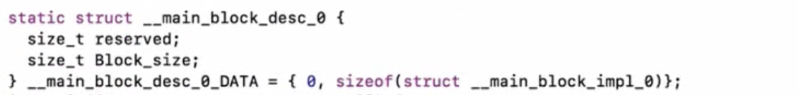
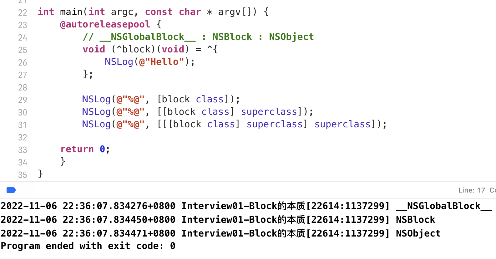

# Block

[TOC]

### 面试题

# Block 的本质

- block本质上也是一个**OC对象**，它内部也有个**isa指针**
- block是**封装了函数调用以及函数调用环境**的OC对象

和OC对象底层一样，Block的底层也是一个结构体

结构体内部

所以block就是指向这个结构体的指针，和OC对象一致

### __block_impl

  

### 参数分析

- 第一个参数 void *fp ：传入的是 **__main_block_func_0**

这个就是block封装的代码

传进来的 **fp函数指针** 又赋值给了结构体内部的 **impl.FuncPtr**

- 第二个参数 是一个结构体指针 **__main_block_desc_0 *desc**

作用是对于一个block的描述信息，size就是block结构体的大小

# Block 的变量捕获 ( capture )

### auto 变量（局部变量）

block在访问外界局部变量时，会新增加一个成员变量

相当于把 age 这个值 捕获进来了

因为局部变量随时可能销毁，所以使用值传递的方法

### static 变量（静态局部变量）

height 的值会随着外界而改变

静态局部变量是指针的形式

静态局部变量的生命周期会持续到程序结束，所以可以随时通过指针取访问那块分配好的内存

### 全局变量

全局变量的效果与静态局部变量差不多，都会随外界变化，但是底层的实现不同

block在访问全局变量时，不会捕获到block内部，采取直接访问的方式（不需要捕获，也不需要指针）

### 一道题

问：这里的 self 是怎么访问的

为什么会被捕获？

- 能被捕获说明 self是一个局部变量

为什么 self 是一个局部变量？

- OC方法内部默认有两个参数 一个是调用者（self），另一个是 SEL _cmd （方法名）

- 函数的参数就是局部变量

# Block 的类型

既然之前说过，Block是OC对象，那么我们就可以通过调用 class 方法来看Block的类型

`__NSStackBlock__` 调用copy后，就升级成一个 `__NSMallocBlock__`