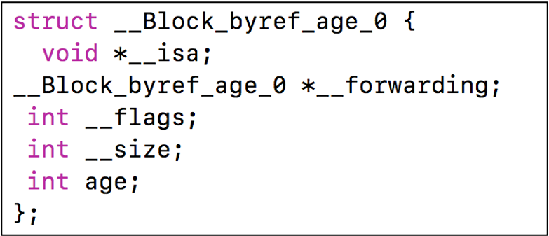
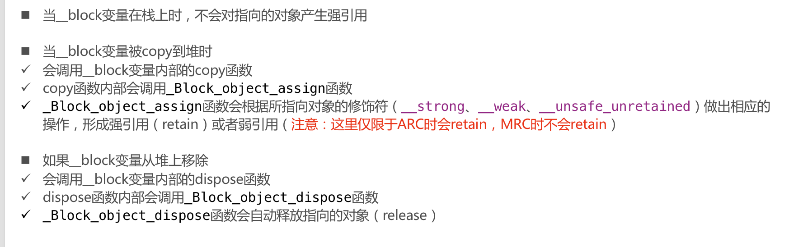

# Block 底层原理

[TOC]

# Block 的本质

- block本质上也是一个**OC对象**，它内部也有个**isa指针**
- block是**封装了函数调用以及函数调用环境**的OC对象

和OC对象底层一样，Block的底层也是一个结构体

结构体内部

所以block就是指向这个结构体的指针，和OC对象一致

### __block_impl

  

### 参数分析

- 第一个参数 void *fp ：传入的是 **__main_block_func_0**

这个就是block封装的代码

传进来的 **fp函数指针** 又赋值给了结构体内部的 **impl.FuncPtr**

- 第二个参数 是一个结构体指针 **__main_block_desc_0 *desc**

作用是对于一个block的描述信息，size就是block结构体的大小

# Block 的变量捕获 ( capture )

### auto 变量（局部变量） 

block在访问外界局部变量时，会新增加一个成员变量

相当于把 age 这个值 捕获进来了

因为局部变量随时可能销毁，所以使用值传递的方法

### static 变量（静态局部变量）

height 的值会随着外界而改变

静态局部变量是指针的形式

静态局部变量的生命周期会持续到程序结束，所以可以随时通过指针取访问那块分配好的内存

### 全局变量

全局变量的效果与静态局部变量差不多，都会随外界变化，但是底层的实现不同

block在访问全局变量时，不会捕获到block内部，采取直接访问的方式（不需要捕获，也不需要指针）

### 一道题

问：这里的 self 是怎么访问的

为什么会被捕获？

- 能被捕获说明 self是一个局部变量

为什么 self 是一个局部变量？

- OC方法内部默认有两个参数 一个是调用者（self），另一个是 SEL _cmd （方法名）

- 函数的参数就是局部变量

# Block 的类型

既然之前说过，Block是OC对象，那么我们就可以通过调用 class 方法来看Block的类型

`__NSStackBlock__` 调用copy后，就升级成一个 `__NSMallocBlock__`

所以在开发过程中，我们都要对block进行copy操作，如果block作为属性，用copy修饰，确保block不被销毁

### Block 的 copy

# Block 访问 auto OC 对象

⚠️当bloc访问**OC对象**的时候（基本数据类型指针不行，必须是**id类型**，并且这个id可以为null，总之只要访问id），block内部的 desc 会发生变化，多两个函数

不管是ARC还是MRC，**栈空间的block不会持有外面对象**

栈空间的block本身随时都会被销毁，没必要强引用其他对象

⚠️与访问的对象是强指针还是弱指针**无关**

**堆空间的block会自动持有外界对象**

ARC不释放是因为**ARC自动调用了copy**，使得栈block变成了堆block

### 如果block被拷贝到堆上（变成堆block）

- 自动会调用**block内部的copy**函数

- copy函数内部会调用 **_Block_object_assign** 函数

- **_Block_object_assign** 函数会根据auto变量的修饰符（__strong、__**weak**、**__unsafe_unretained** ）做出**相应的操作**，形成强引用（retain）或者弱引用

- **_Block_object_assign这个函数的作用是将block内部所有要访问的变量都拷贝到堆上去**

是因为block对象内部有一个强类型的指针指向外界这个对象，只有当block销毁时，MJPerson会释放，**第27行，block还没销毁**

由于这里是 weak 弱引用，所以person离开作用域就销毁了

#### MRC的情况 - 不copy

#### MRC的情况 - 调用 copy

这种情况下 block就持有 person对象

### 如果block从堆上移除

- 会调用block内部的dispose函数

- dispose函数内部会调用_Block_object_dispose函数

- _Block_object_dispose函数会自动释放引用的auto变量（release）

# __block 修饰符

默认情况下，block 内部不允许**修改**外界的局部auto变量

注意修改和使用的区别

对于对象来说，调用对象的方法**不属于修改**

修改对象的属性也**不属于修改**

只要不给对象（这个指针）赋值新值，就不算修改

#### 方法一 改为 static

因为static变量是通过 **指针** 捕获

#### 方法二 使用 __block 修饰

### __block 的本质

- __block可以用于解决block内部无法修改auto变量值的问题
- __block**不能修饰全局变量、静态变量**（static）
- 编译器会将__block变量**包装成一个对象**，**block强引用这个包装的对象**

**__block int age = 10 的本质**

# __block 的内存管理

- 当block在**栈**上时，并不会对__block变量产生强引用

- 当block被copy到**堆**时
  - 会调用block内部的**copy**函数
  - **copy**函数内部会调用**_Block_object_assign**函数
  - **_Block_object_assign**函数会对**__block变量**形成强引用（retain）

- 当block从堆中移除时 
- 会调用block内部的**dispose**函数
- **dispose**函数内部会调用**_Block_object_dispose**函数
- **_Block_object_dispose**函数会自动释放引用的**__block变量**（release）

⚠️ 这里和**block访问auto OC对象的过程很类似**，接下来做出一个区分

### __block 和 访问 auto OC 对象的区别

#### 相同点

- 因为本质上 __block 也是OC对象，所以block内部需要进行**内存管理操作**（retain和release）

- 都是调用 copy 和 dispose 

#### 不同点

- __block 既可以给基本类型变量使用，也可以给OC对象用，访问基本类型auto变量不会生成内存管理代码，只有访问 auto OC 对象才会
- __block是用于在block中修改变量的值，由于是包装成对象，顺便带了内存管理，访问auto OC 对象本来就需要内存管理
- __block **都是强引用**，而访问 auto OC 对象需要看**原本访问是用的强指针还是弱指针**，
- 所以 `__block` 和 `__weak` 一起用于非OC对象会警告

- OC 对象传入 **3**
- __block 对象传入 **8**

### __forwarding指针

 为什么要设计这样一个指针，为了赋值到堆空间去，因为 __block变量 可能一开始在栈上，最后会拷贝到堆上，由于是拷贝，为了防止访问的时候访问到栈上的，所以在block复制到堆之后，原本栈里的block的`__forwarding`指针**指向的是堆空间的block**，堆空间的block的`__forwarding`指针指向自己

外界访问block有可能是拿到的栈空间的block，这样设计就不管访问的是哪一个，最终的效果都是访问堆空间的那个

### 被__block修饰的OC对象

   

__block包装对象内多了两个函数

- **__Block_byref_id_object_copy**

- **__Block_byref_id_object_dispose**

### `__block`  和 `__weak` 同时使用

之前非OC对象是不能同时使用的

但是OC对象是可以同时使用

### MRC 下使用 __block 需要注意的问题

不使用 __block，普通OC对象，MRC，在调用block的copy之后，block内部会执行一次**retain**

这种情况下只有当 block 也被释放的时候，person才会释放

⚠️  MRC下，__block 不会自动调用 retain

### __block 内存管理小结

使用 __block修饰变量会包装成一个新的结构体（无论基本数据类型还是OC对象都一样）

block结构体的内部**强引用**这个新的结构体（无论传进来的是strong还是weak）

这个新结构体内部会根据传进来的是strong还是weak，引用传进来的对象

# Block 循环引用问题

### 解决循环引用 —— ARC

#### `__weak` 和 `__unsafe_unretained` 的区别

- 相同点：不会产生强引用
- 不同点
  - **__weak** 所指向的对象释放后，会自动调用 **objc_loadWeak()** 和 **objc_storeWeak()** 来检查引用对象是否销毁，置空指针，增加了性能开销
  - **__unsafe_unretained** 不会自动置空指针，会指向那块已经回收的内存，所以是不安全的

weakSelf 是 __block 包装的变量，本身是一个strong类型的指针（不用weak修饰，默认就是strong）将self赋值给weakSelf, 相当于weakSelf持有self,这样会产生循环引用

由于是 __block 修饰的变量，可以在block中改变这个指针的值，只需要**将 weakSelf 置为 nil**，即可解决循环引用问题

⚠️注意如果使用 __block，必须要调用这个block，调用这个block才会执行里面的代码

### 解决循环引用 —— MRC

MRC不支持弱指针

所以在MRC下使用 __weak会失效

