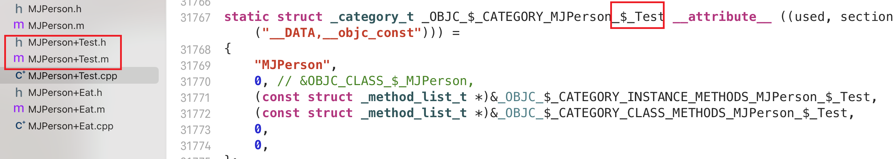
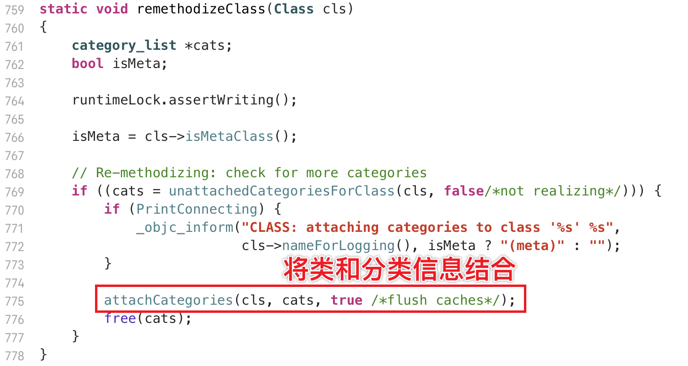
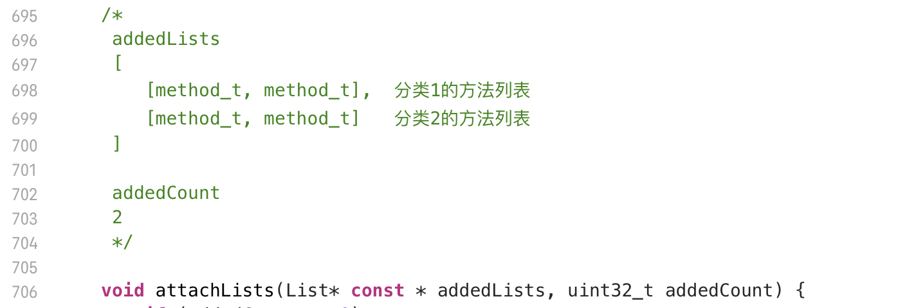
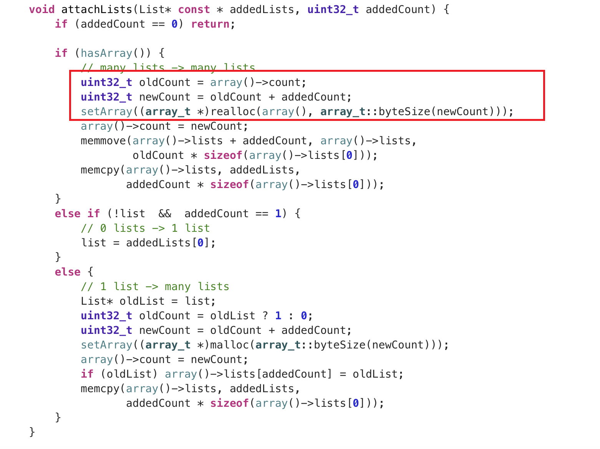
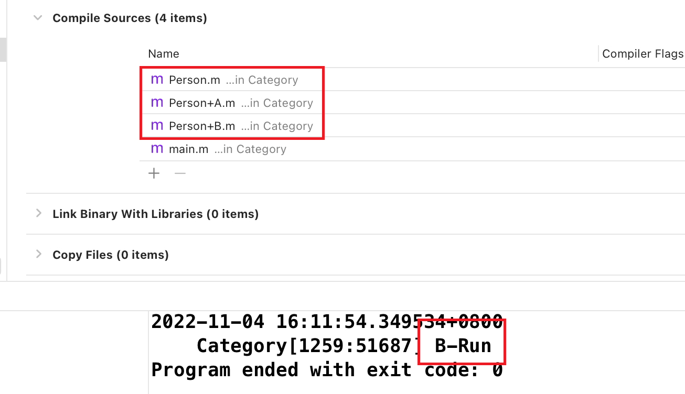
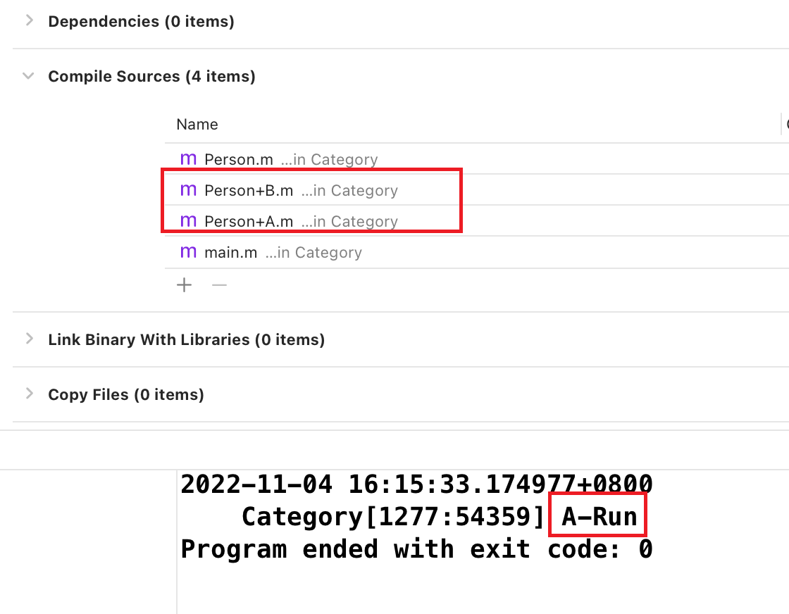
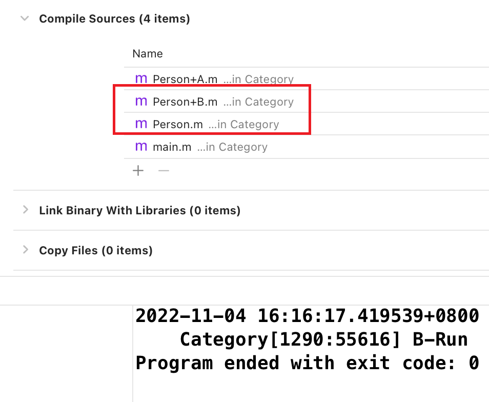
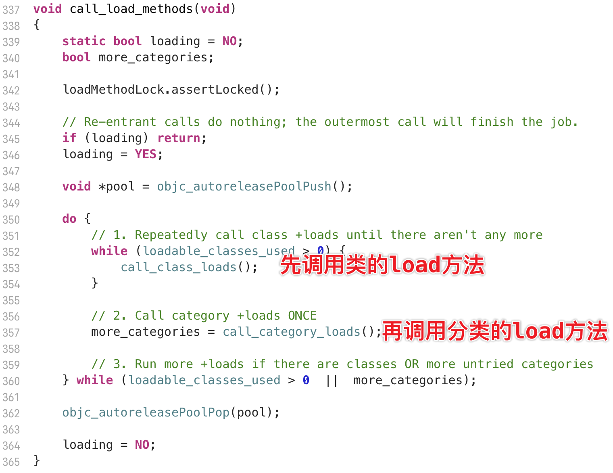

# Category

[TOC]

### 面试题

**Category的使用场合是什么 ？**

- 动态地为已经存在的类添加新的方法

  

**Category的实现原理**

- **Category** 编译之后的底层结构是 **struct category_t** ，里面存储着分类的对象方法、类方法、属性、协议信息

- 在程序运行的时候，**runtime** 会将 **Category** 的数据，合并到类信息中（类对象、元类对象中）

**Category和Class Extension (类扩展) 的区别是什么 ？**

- **Class Extension** 在编译的时候，它的数据就已经包含在类信息中

- **Category** 是在运行时，才会将数据合并到类信息中

**Category中有load方法吗？load方法是什么时候调用的？load 方法能继承吗？**

- 有 **load** 方法，类和分类都有 **load** 方法

- **runtime** 在加载每一个类和分类的时候，都会去调用对应的 **load** 方法，由于是直接找地址调用，不会出现分类覆盖掉原本类的实现

- 能继承，如果子类没有实现 **load** 方法，手动调用 **load** 方法会去找父类的 **load** 方法（而且是优先调用分类的 **load**，和顺序的原理一样），不过没有任何一个场景需要手动调用 **load** 方法，没有意义

  

**load、initialize方法的区别什么？它们在category中的调用的顺序？以及出现继承时他们之间的调用过程 ？**

区别

- 调用方式
  - load 是直接根据**函数地址**直接调用
  - initialize 是**消息发送（objc_msgSend）**，特性和一般的对象方法，类方法一致
- 调用时刻
  - load 是**rumtime初始化，加载类/分类的时候**调用，在main函数之前，**即使没有使用**，也会将类、分类的信息加载进内存，所以也会调用 load 方法，**只会调用一次**，加载完毕之后就不会再调用了
  - initialize 是 **类 第一次收到消息 **时调用，如果没有使用这个类，就不会调用 initialize 。initialize的本质上是类在寻找方法时会判断类是否初始化，如果未初始化，则调用 initialize 方法，每一个类只会 initialize 一次，如果子类没有实现initialize 方法，父类的 initialize 方法可能会调用多次
- 调用顺序
  - load：
    - 首先调用类的 load 方法，调用类的load方法时，**先调用这个类父类的load**（递归，与编译顺序无关，即使父类后编译，也是先调用父类load）
    - 当**类的load全部调用完毕**后，再根据**编译的顺序**调用分类的 load 方法，这个时候和继承关系无关，只和编译顺序有关
    - 换而言之，先把所有的类按照继承顺序加载完毕，后面加载分类的顺序就无所谓了
  - initialize：
    - initialize 方法和常规的方法大差不差，先通过isa寻找到元类对象，找元类对象中有没有 initialize的实现，如果没有，会通过superclass指针找父元类。
    - **先初始化子类，再初始化父类**（与编译顺序无关）
    - 如果子类没有实现 initialize，那么**父类的initialize可能会调用多次**（消息转发）
    - 和常规的方法一样，**分类中同名的方法优先级高**，如果分类有实现 initialize ，那么就会执行分类的 initialize （消息处理），如果有多个分类，就会从最后编译的开始找（**后编译的方法放在方法列表的前面**），这一点和常规的类方法没什么不同

**load方法有什么用？**

- 因为load方法只会调用一次，所以可以用来初始化全局变量，给全局变量赋值

**Category能否添加成员变量？如果可以，如何给Category添加成员变量 ？**

- 不能直接添加成员变量，因为objc_class结构体中**ivars成员变量信息**是放在**只读**的**class_ro_t**结构体中，类一旦生成，就不能动态的添加成员变量
- 可以通过关联对象间接实现Category有成员变量的效果

### Category 底层原理

**Category** 没有新创建一个类，而是将各个分类的方法信息，合并到最原始的类对象（或者元类对象）中

合并的执行不是编译的时候，而是程序运行时（**Runtime**）合并的

分类的源文件编译后，会生成一个结构体

编译完还没运行的时候，分类的信息就存放在这里

程序运行的时候，会通过 **Runtime** 将方法信息合并到类对象中

其中 **_protocol_list_t** 和 **_prop_list_t** 说明了分类可以遵循协议，访问属性

每写一个分类，都会生成一个对应的结构体变量

### Category 能不能添加成员变量

不能添加成员变量

可以写 **@property** 不过只会做一件事，就是set/get方法的声明

不会生成 成员变量 以及set/get方法的实现

说白了，可以添加属性，但是属性对应的成员变量无法直接添加

#### 能不能用全局变量？

不能，全局变量内存只有一份，如果多个类的属性名相同，就会冲突

#### 能不能用一个字典？

可以,但存在一些问题，内存泄露，线程安全，麻烦

 

#### 最终方案：关联对象

### 关联对象

参数说明

- object : 给哪个对象增加关联对象
- key : 键 （属性名）
- value : 值 （属性的数值）
- policy : 关联策略

#### key的用法

### Category 执行流程

在 objc-os.mm 中

运行时初始化，读取模块（**images**）信息时

将读取到的信息，附加到类中

新添加的方法会**放在前**面

### Category 注意事项

- 如果分类里面定义了名字相同的方法，会执行分类的方法

- 如果有多个名字相同的方法，会根据**编译的顺序**，后编译的会附加在 **rw->methods** 的最前面，所以就会执行这个方法的实现
- **越后编译的优先级越高**

原本类实现的编译顺序不影响，只有**分类的编译顺序**会影响

# Extension

### Extension 简介

- Extension （类扩展），看起来**像**一个**匿名**的 Category, 但是和 Category 完全是两个东西,

- **category是拥有.h文件和.m文件的东西。但是extension不然。extension只存在于一个.h文件中，或者寄生于一个类的.m文件中。**多数情况下寄生在宿主类的 .m 中
- 系统创建的 ViewController 就自带一个没有任何内容的 Extension

### Extension 作用

- 声明**私有**属性，**私有**成员变量
- 声明**私有**方法

### Category 和 Extension 的 区别

- extension 可以声明私有的属性，并且自动添加成员变量。而 category 只能声明属性，**不能添加成员变量**
- extension 中声明的方法没有实现会**警告**，category 的方法没有实现**不会警告**
- extension 是**编译**时确定的，category 是**运行时**确定的
- category 原则上**只能增加方法**，并且是公开的。扩展能添加方法，实例变量，默认是**@private**类型的，**且只能作用于自身类**，不能用于子类或者其他地方

- category 可以为**系统类**添加分类；extension **不可以为系统类添加扩展** (必须有一个类的源码才能添加一个类的 extension)
- 定义在 **.m** 文件中的类扩展方法为私有的，定义在 **.h** 文件（头文件）中的类扩展方法为公有的。**类扩展**是在 **.m 文件中声明私有方法的非常好的方式**

# load 方法

**load** 方法会在 **Runtime** 加载**类**、**分类**的时候调用

**即使没有使用**，也会将类、分类的信息加载进内存，所以也会调用 **load** 方法

分类不会覆盖掉原本类的 **load** 方法

### load 方法的调用顺序

- 先调用类的 **load** 方法（即使编译顺序在分类后面）

- 按照编译先后顺序调用分类的 **load** 方法（先编译，先调用）

- 先调用父类的 **load** 方法，再调用子类的 **load** 方法

首先调用类的 load 方法，调用类的load方法时，先调用这个类父类的load（递归）

当类的load全部调用完毕后，再根据编译的顺序调用分类的 load 方法，这个时候和继承关系无关，只和编译顺序有关

换而言之，先把所有的类按照继承顺序加载完毕，后面加载分类的顺序就无所谓了

### load 方法底层原理

#### 为什么一般的方法只会调用一次，而load方法会调用多次？

**load** 方法的本质是直接拿到方法地址，调用

而一般的方法是通过 **objc_msgSend()** 消息发送机制，只要这个消息被处理了，就不用往下找了

# initialize 方法 

**initialize** 方法会在 **类** **第一次接收到消息**时调用

`[Person alloc]`

无论有多少个分类，**initialize** 方法只会调用一次，优先也会调用分类的 **initialize** (顺序和常规方法一样，后编译优先级高)

因为 **initialize** 方法和 **load** 方法不一样，**initialize** 方法属于传统的消息发送 （**objc_msgSend**）

只要有一个对象处理了消息，消息的发送就完成了

如果不使用类，就不会调用这个类的 **initialize** 方法，这一点和 **load** 方法也不一样，**load** 方法即使不使用，也会调用（ **load** 属于类信息的加载，作用于 **Runtime** 的初始化）

调用子类的 **initialize** 之前，会调用父类的 **initialize**

### initialize 方法底层原理

调用方法肯定需要通过 **isa / superclass** 寻找方法

如果是第一次寻找方法，那么就 **initialize**

 

寻找方法的函数 **class_getInstanceMethod() / class_getClassMethod**

### initialize 注意事项

- 如果子类没有实现+initialize，会调用父类的+initialize（所以父类的+initialize可能会被调用多次）

- 如果分类实现了+initialize，就覆盖类本身的+initialize调用
