# Category

### 面试题

**Category的使用场合是什么？**

**Category的实现原理**

- Category编译之后的底层结构是struct category_t，里面存储着分类的对象方法、类方法、属性、协议信息

- 在程序运行的时候，runtime会将Category的数据，合并到类信息中（类对象、元类对象中）

**Category和Class Extension (类扩展) 的区别是什么？**

- Class Extension在编译的时候，它的数据就已经包含在类信息中

- Category是在运行时，才会将数据合并到类信息中

### Category 底层原理

Category 没有新创建一个类，而是将各个分类的方法信息，合并到最原始的类对象（或者元类对象）中

合并的执行不是编译的时候，而是程序运行时（**Runtime**）合并的

分类的源文件编译后，会生成一个结构体

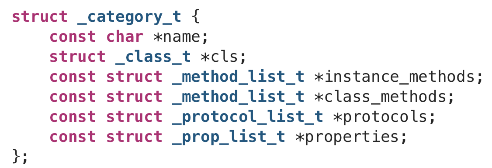

编译完还没运行的时候，分类的信息就存放在这里

程序运行的时候，会通过 **Runtime** 将方法信息合并到类对象中

其中 **_protocol_list_t** 和 **_prop_list_t** 说明了分类可以遵循协议，访问属性

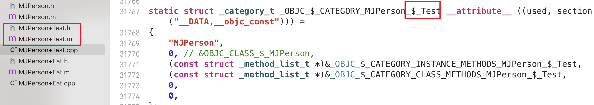

每写一个分类，都会生成一个对应的结构体变量

### Category 执行流程

在 objc-os.mm 中

运行时初始化，读取模块（images）信息时

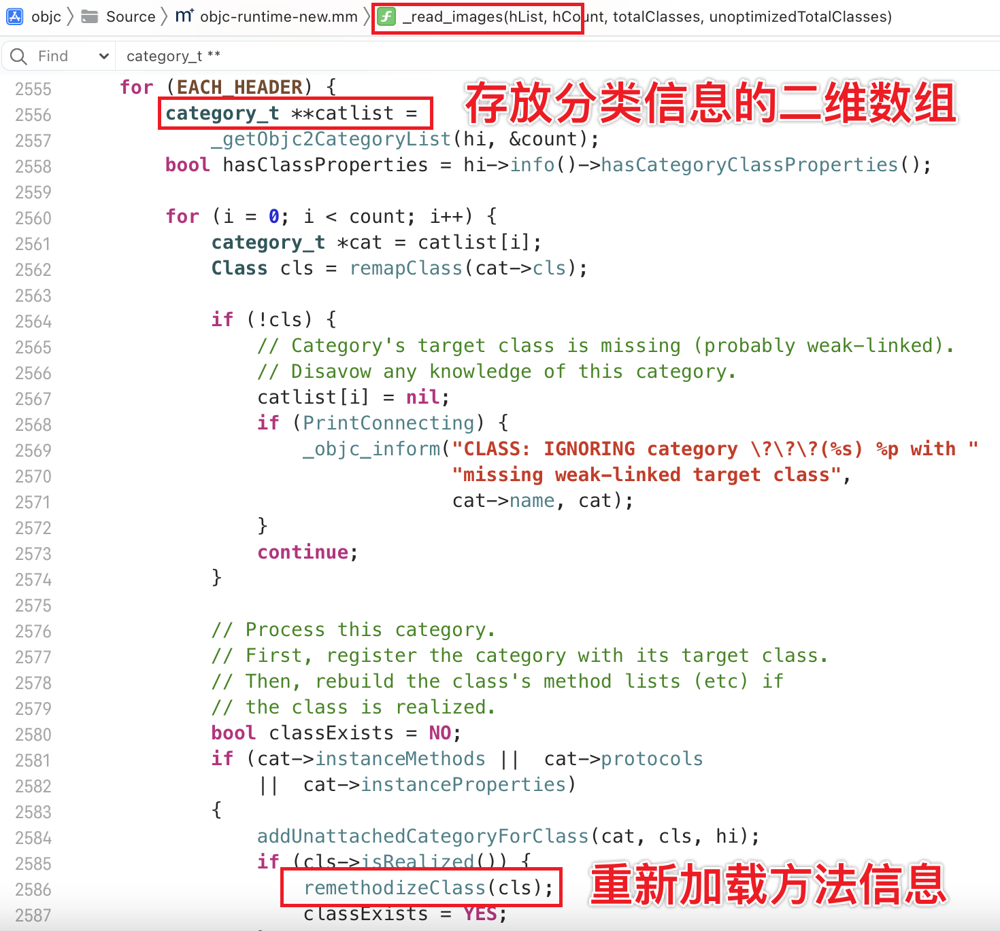

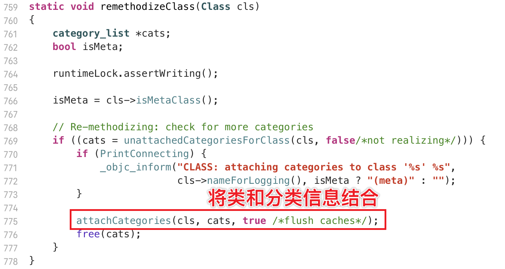

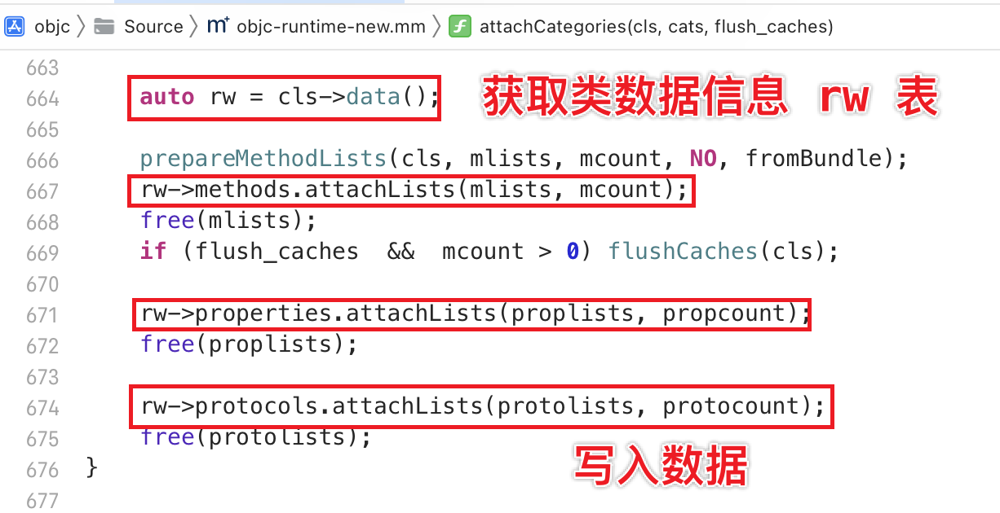

将读取到的信息，附加到类中

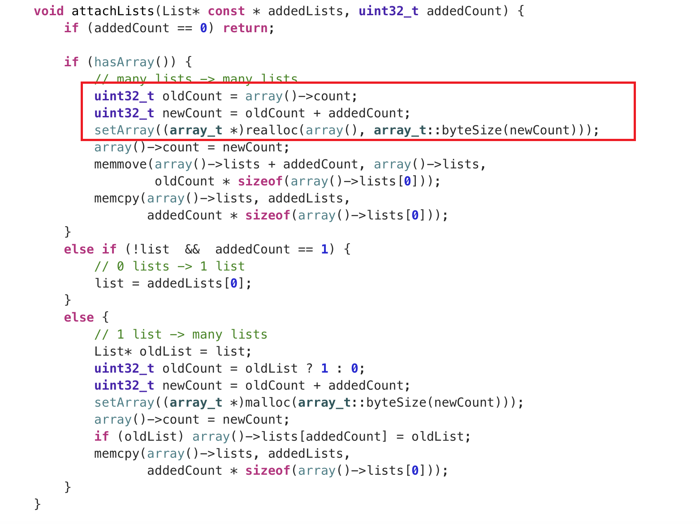

新添加的方法会**放在前**面

### Category 注意事项

- 如果分类里面定义了名字相同的方法，会执行分类的方法

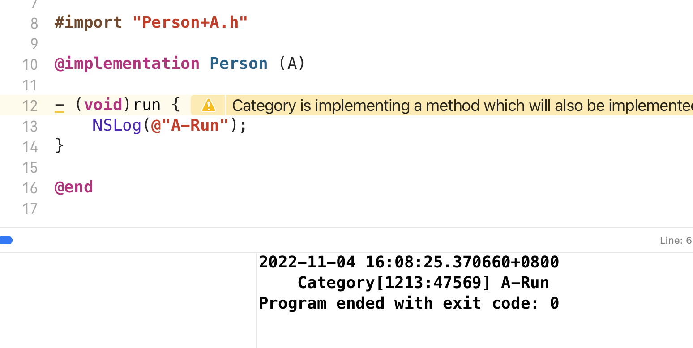

- 如果有多个名字相同的方法，会根据**编译的顺序**，后编译的会附加在 **rw->methods** 的最前面，所以就会执行这个方法的实现

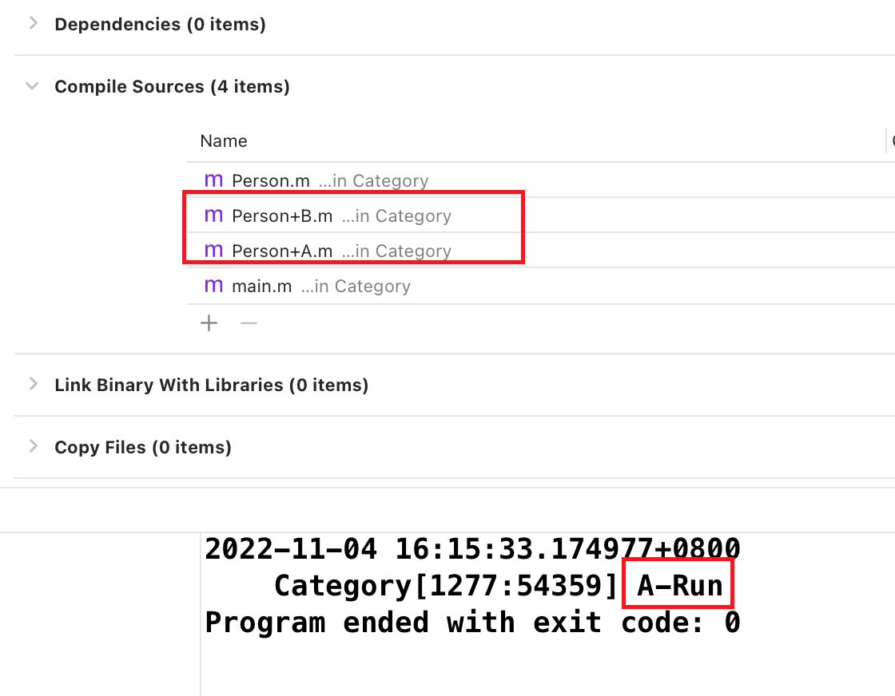

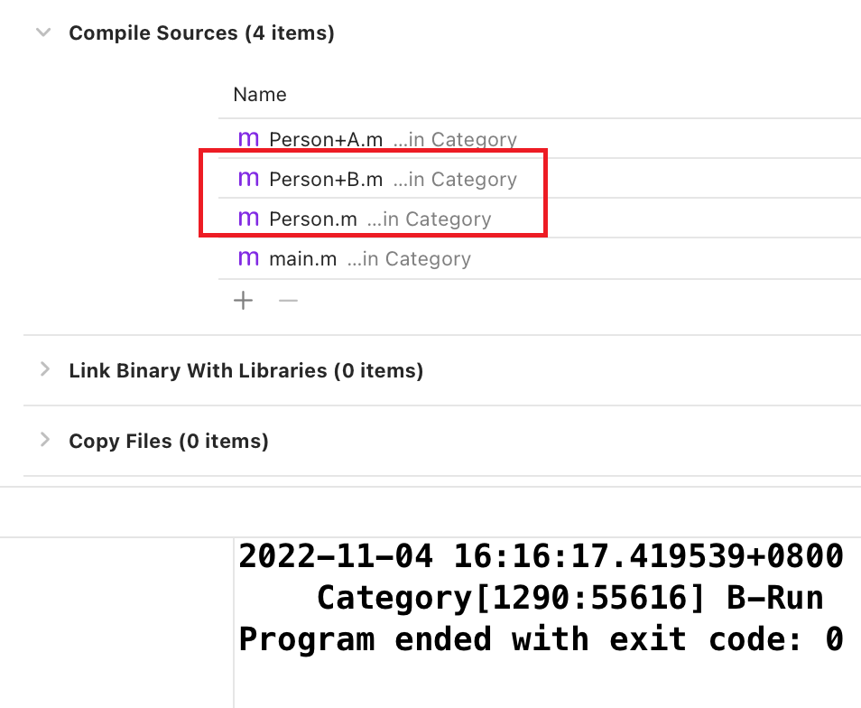

原本类实现的编译顺序不影响，只有**分类的编译顺序**会影响

# load 方法

**load** 方法会在runtime加载**类**、**分类**的时候调用

**即使没有使用**，也会将类、分类的信息加载进内存，所以也会调用 **load** 方法

分类不会覆盖掉原本类的 **load** 方法

### load 方法的调用顺序

和分类方法一样，**与编译顺序有关**

无论主类什么时候编译，先调用的一定是原本类的load方法

分类的load方法与分类的编译顺序有关

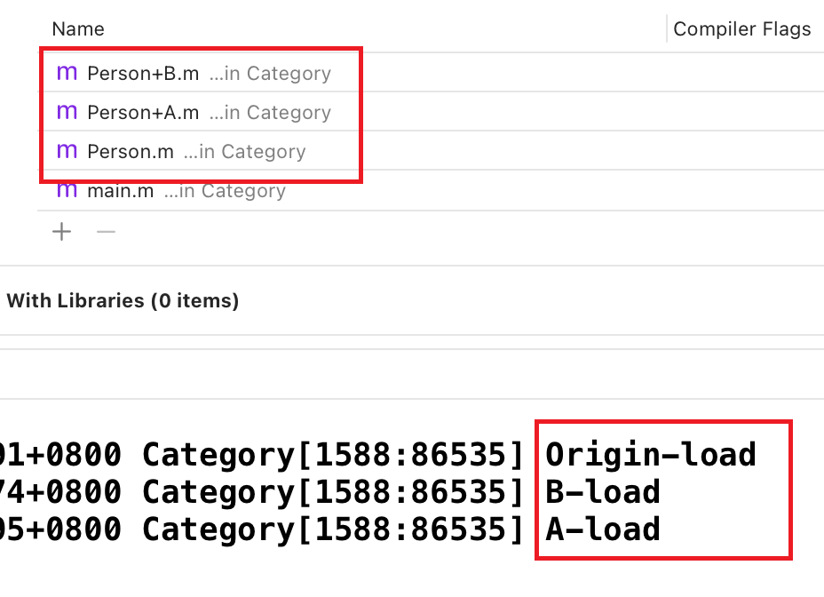

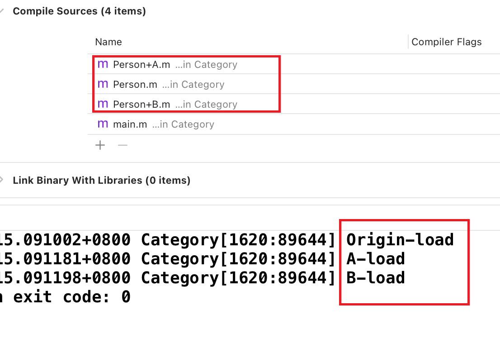
