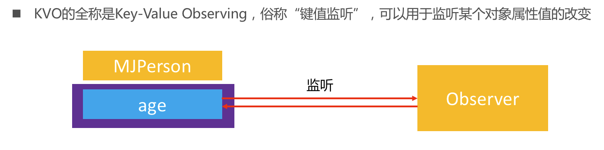
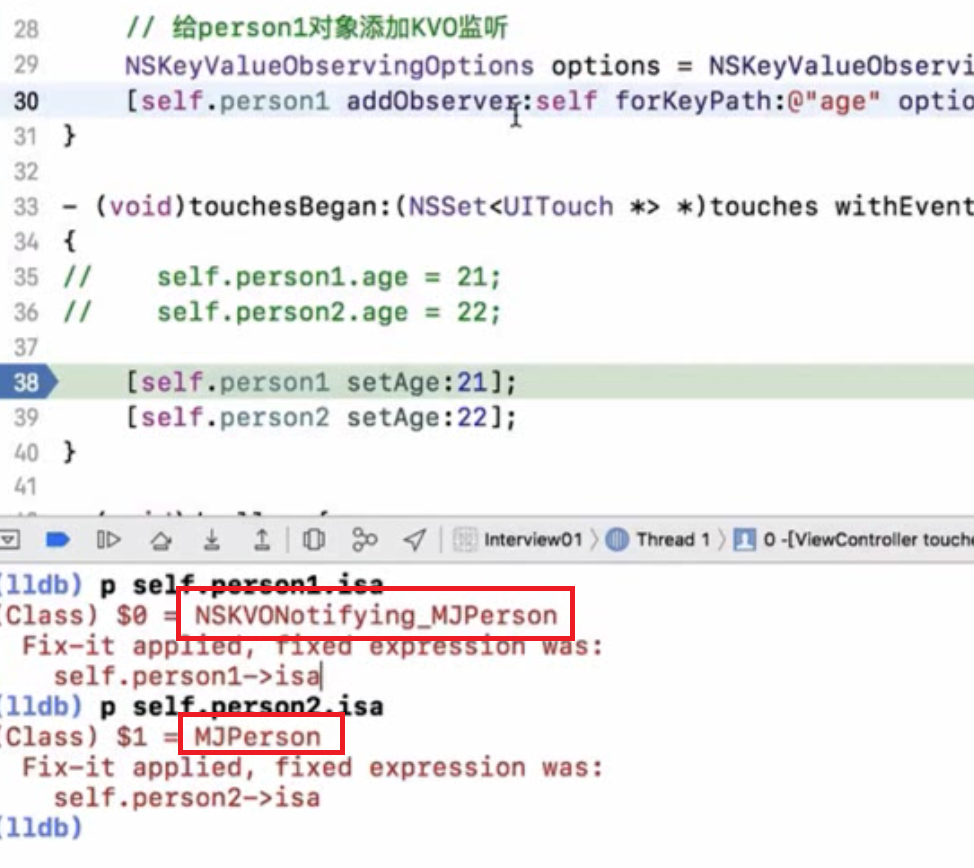
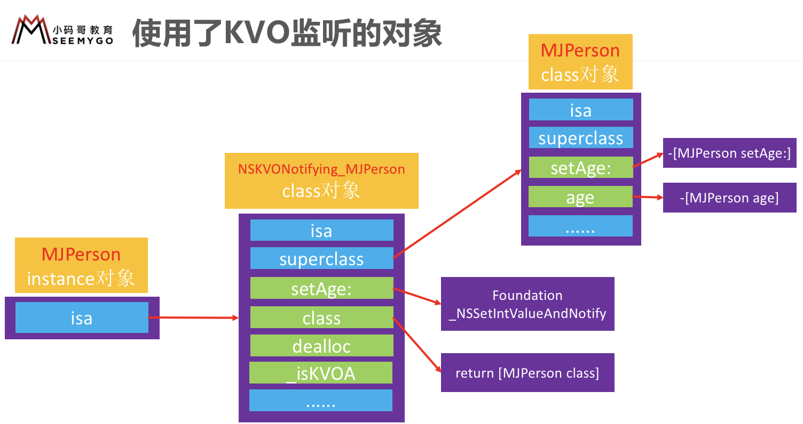
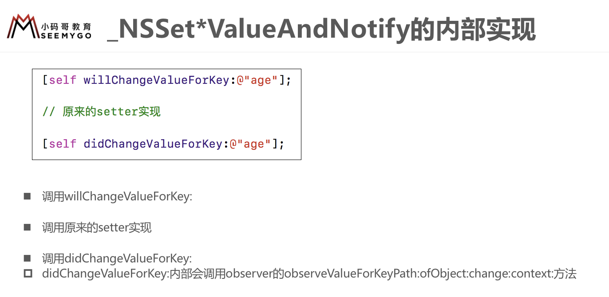

# KVO

### 面试题

**iOS用什么方式实现对一个对象的KVO？(KVO的本质是什么?)**

### KVO 简介

- 为对象添加Observer：**addObserver...**

- Observer 监听 MJPerson 的 age 属性，当age发生改变时，Observer 会做出反应 （调用Observer的 **observeValueForKeyPath: ofObject: change: context:**）

- 当不使用的时候，需要移除监听器，可以在dealloc里移除 (**removeObserver...**)

### KVO的本质

- 对一个实例对象添加Observer（KVO）,会改变该对象的isa指向
- 原本实例对象是指向类对象，但**添加KVO之后**的实例对象指向 **NSKVONotifying_XXX** (XXX 表示原类名) 类对象
- **NSKVONotifying_XXX类对象** 的  **superclass** 指向 **XXX类对象**
-  **NSKVONotifying_XXX** 的 set方法实现进行了修改，内部调用的是 **Foundation** 的函数 _NSSet*****ValueAndNotify (*表示数据类型)

