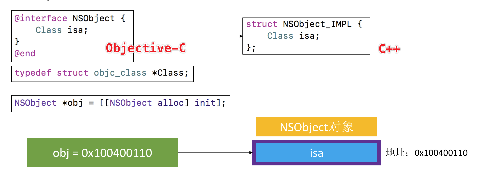
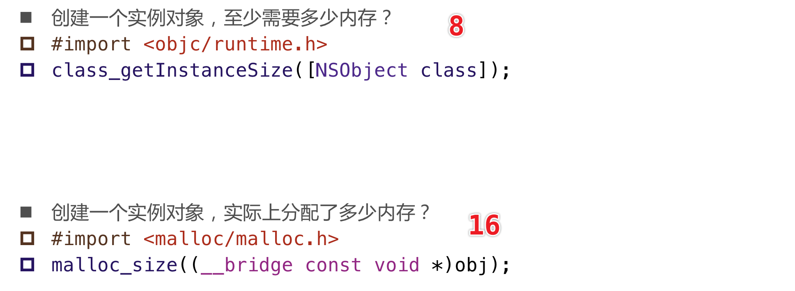

# OC对象的本质

### NSObject 底层实现

- IMPL 指的是 Implementation
- 对象在内存中就是结构体

- NSObject 内部只有一个 isa 
- isa （Class）是一个**指针**， 指向了 **objc_class 结构体** 类型的指针，在64位环境下占**8个字节**

理论上 **NSObject** 只占8个字节，因为它只有一个成员变量 **isa**

### NSObject 实际上占多少内存

**OC 与 C 类型互转要加上 __bridge 关键字**

**class_getInstanceSize** 返回的是成员变量（Ivar）所占用的空间

**malloc_size** 返回的是真正分配内存的空间
