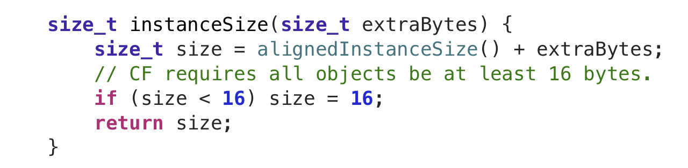
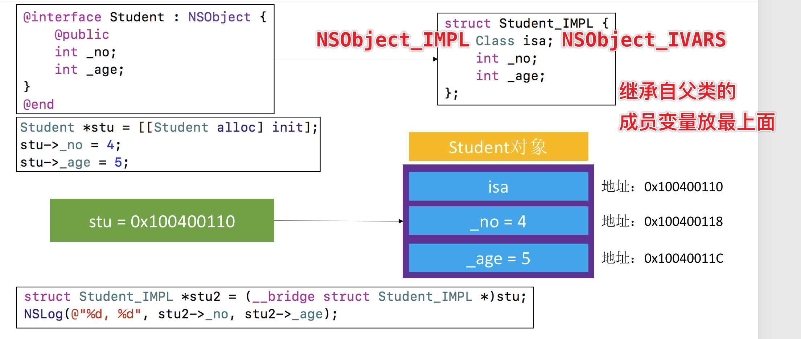
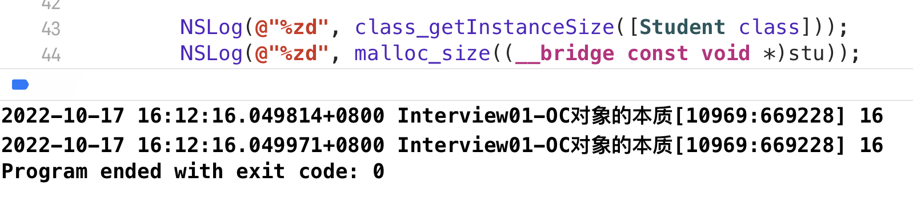
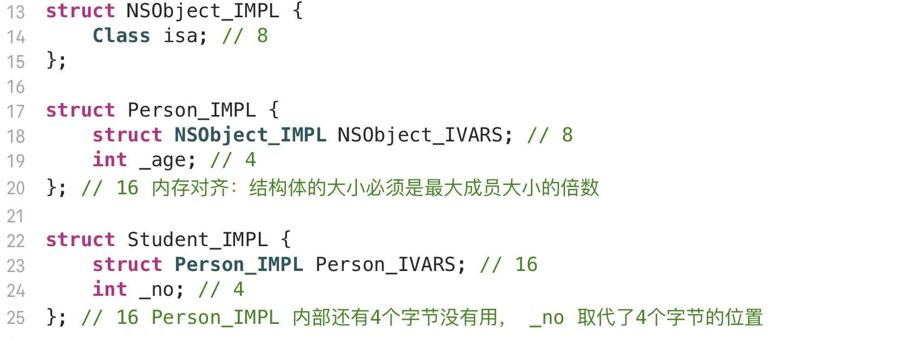
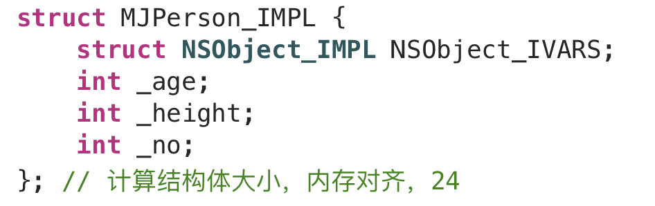
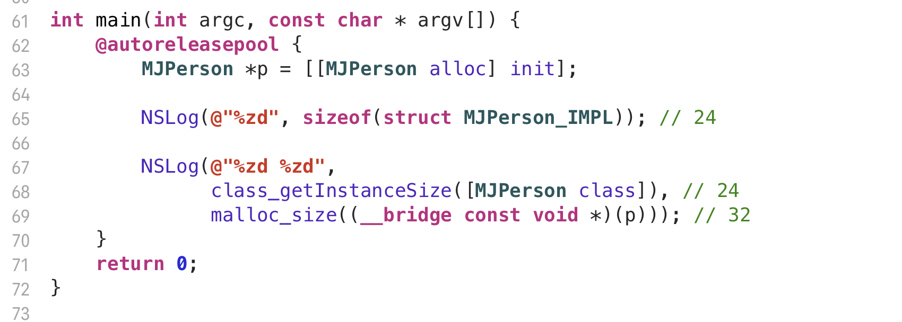
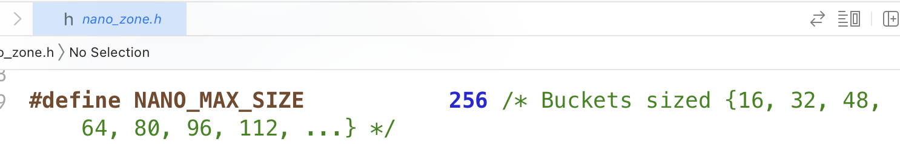

# OC对象的本质

### NSObject 底层实现

- IMPL 指的是 Implementation
- 对象在内存中就是结构体

- NSObject 内部只有一个 isa 
- isa （Class）是一个**指针**， 指向了 **objc_class 结构体** 类型的指针，在64位环境下占**8个字节**

理论上 **NSObject** 只占8个字节，因为它只有一个成员变量 **isa**

### NSObject 实际上占多少内存

**OC 与 C 类型互转要加上 __bridge 关键字**

**class_getInstanceSize** 返回的是成员变量（Ivar）所占用的空间

**malloc_size** 返回的是真正分配内存的空间

### CF (CoreFoundation) 对象最低内存限制

- 如果对齐之后的大小（class_getInstanceSize）小于 16 字节，则返回16字节

### 自定义类的底层实现

由此可以看出 **stu** 的本质就是 **Student_IMPL** 结构体

- Student 成员变量所占内存：**8 + 4 + 4 = 16 **

- Student 实际分配内存大小 **16**

### 大小端

小端CPU读取字节从高字节地址读取

| 0x0001 | 0x0002 | 0x0003 | 0x0004 |
| ------ | ------ | ------ | ------ |
| 04     | 00     | 00     | 00     |

所以如果是小端CPU，这个字节读取的值是 **0x 00 00 00 04**

换句话说，小端模式是指高字节地址存储高位，低字节地址存储低位

### 结构体内存对齐

- 即使CF不限制分配内存大小，**Person_IMPL** 成员变量仍然占16字节

### 属性和方法

用 **@property** 声明属性的时候，会生成 **_属性名** 的成员变量

但是方法不是存储在结构体中

- 因为方法都是一样的，只要一份就够了，不需要每个实例对象都存储

- 每个实例对象有不同的属性，所以每个实例对象内部需要存储自己的成员变量

### 内存分配问题

#### alloc size 分析

calloc 底层在分配内存的时候，也存在对齐（不是结构体内存对齐）

如果要分配 81个字节 最后1字节就不好管理

内存都是一块一块分配的

所以请求24字节，分配了32字节

在OC里面 分配对象的内存都是 **16的倍数**

这样访问最快
