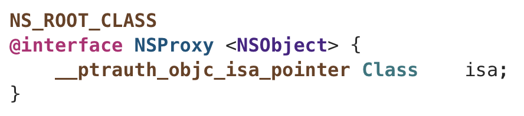

# 内存管理

### CADisplayLink、NSTimer使用注意

在使用下面两个API的时候，CADisplayLink、NSTimer会对**target**产生强引用，如果**target**又对它们产生强引用，那么就会引发**循环引用**

即使传进去是**weak类型的指针**，也没有办法解决循环引用的问题

这是因为无论是 **weakSelf** 还是 **self** 其本身的指向的地址是一样的

**__weak** 的作用是修饰一个弱引用对象，让这个对象的引用计数不会 +1，一般用于解决 **block的循环引用** 问题

但是对于这两个API来说，target参数是一个id，最终是取得对象的地址，然后对这个对象进行强引用，这个时候外界传入的到底是强指针还是弱指针已经没啥关系了

#### 解决方法1  使用block

#### 解决方法2 使用代理对象

这是原本循环引用的状态

使用代理对象的结果

代理对象的思路：

- 为了避免循环引用，需要用弱指针指向原本需要代理的对象
- Timer设置Target的时候，使用代理对象
- Timer给代理对象发消息，代理对象会将消息转发至原对象

# NSProxy

NSProxy 和 NSObject 一样，属于**基类**，一般用于子类来继承，不会单独使用

### NSProxy 的特点

- NSProxy 没有 init 方法
- NSProxy 的父类不是 NSObject，NSProxy 和 NSObject 是同级的
- NSProxy 和 NSObject 都遵守 <NSObject> 协议，理论上两者拥有完全一样的方法声明，不过 **NSProxy有一些方法没有实现**

# Tagged Pointer 

堆空间对象 地址末位一定是0 OC对象内存以16对齐 结构体地址一定是16的倍数

 tagged pointer末位一定是1 ？

现在已经无法通过直接查看内存地址来查看 Tagged Pointer的值了，苹果做了加密，无法伪造，**进程启动时与随机值混合的**

实测堆区地址比栈区大？ 堆区地址基本正常，但是栈区地址比堆区小很多

# Autorelease

调用了 autorelese 的对象会添加到最近的**自动释放池（Autoreleasepool）**中

- 自动释放池是OC的内存自动回收机制
- 当自动释放池销毁时，池里的所有对象都会调用一次 **release** 方法

### Autoreleasepool的底层

@autoreleasepool 的底层定义了一个**结构体变量**

结构体的类型是 __AtAutoreleasePool 

变量名是 __autoreleasepool

### __AtAutoreleasePool

当生成结构体变量的时候，会自动调用构造函数

当销毁结构体变量的时候，会自动调用析构函数

### objc_autoreleasePoolPush()

### objc_autoreleasePoolPop()

可以看出 调用了autorelease的对象最终都是通过**AutoreleasePoolPage**对象来管理的

