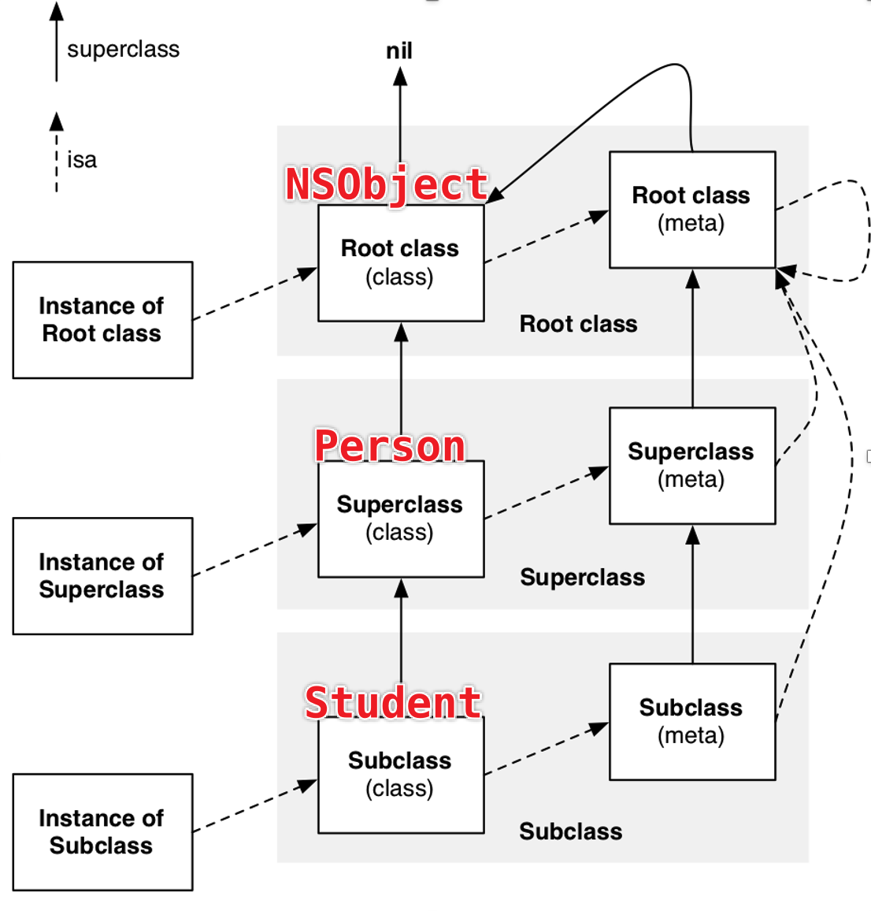

# OC对象的分类

- **instance **  (**实例**对象)

- **class**   (**类**对象)
- **meta-class**   (**元类**对象)


### instance 实例对象


- 实例对象内部存储成员变量的值


### Class 类对象


```objective-c
typedef struct objc_class *Class
```

- Class 的本质是指向一个 **objc_class** 结构体的指针

- 一个类的类对象是唯一的，在内存中只有一份

- 注意存储的是 **成员变量信息** （类型，名字） 不是成员变量的具体值


### meta-class 元类对象

> meta-data 元数据，用来描述数据的数据
>
> meta-class 元类，用来描述类的类

- 元类对象也是 **Class** 类型


- 注意元类对象只能通过 Runtime去获取，[NSObject class] class]] 只能获取类对象（无论调用多少次class方法）

- objc_getClass 内部是根据名字找 **类对象**，无法访问元类对象
- object_getClass 内部是访问 **isa指针**


# isa & superclass

### isa

isa 的本质是指向 **Class** 类型的一个指针


### superclass （父类指针）

#### class对象的superclass指针


#### meta-class对象的superclass指针


### 总结



- 当调用类方法时，会从本类的meta-class中寻找实现，如果没有，会从父类的meta-class中寻找实现，如果找到NSObject（基类）的meta-class都没有找到的话，**NSObject (meta-class)的superclass指向NSObject (class)**，NSObject（class）存储的是NSObject的实例方法实现，如果找到同名的，则调用这个实例方法，方法的调用者仍然是**最开始的那个类**，如果还找不到，就包unrecognized selector sent to class : xxx


# isa 细节


- 实际上isa和对应类的地址的值不是直接相等的

- 从 64bit 开始，isa需要进行一次位运算，才能计算出真实地址


- **superclass** 指针不存在这个问题


# struct objc_class

```objective-c
typedef struct objc_class *Class
```

objc_class 就是 Class 的本质

