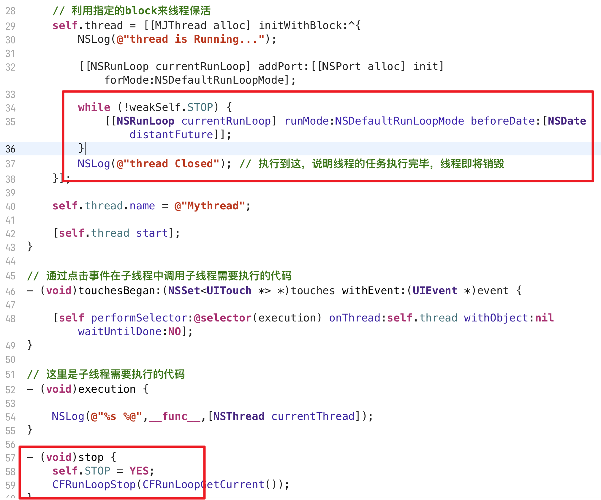

# 为什么需要线程保活

默认情况下，新创建一个子线程，**执行完任务后就销毁了**

如果需要在子线程上执行很多事，假设现在每在屏幕上点一次，就需要在子线程中打印一句话

每执行一次都要创建一次线程，这就增加了性能消耗，所以需要我们**手动管理线程的生命周期**，简称线程保活

### 死循环能解决问题吗

死循环可以让线程的任务永远执行不完， 就不会被销毁

但是这样做有非常大的问题

线程确实不会死了，但是这个线程想要做其他事就非常困难了（线程忙着处理这个死循环,无法往下走）

# 使用 RunLoop 实现线程保活

线程的任务一旦执行完毕，生命周期就结束，无法在使用

即使使用**强指针指向也没用**，**线程的内存没有被销毁**，但是处于**不可用**状态

使用RunLoop可以让线程保持激活状态

使用RunLoop的好处在于，虽然也是阻塞线程，但是可以让线程没事做的时候休眠，节约资源

 

线程创建的时候没有RunLoop对象，不过不需要手动创建，只需要获取一次就自动创建了。

可以看到即使加了 RunLoop 但是并没有起到阻塞的效果

**⚠️ 这是因为在默认情况下，只要RunLoop里面没有任何Source0/Source1/Timer/Observer，RunLoop会立马退出**

所以需要往RunLoop里加东西，不妨加一个 Source1 相关的 NSPort

可以看到没有执行 execution end 说明起到了线程阻塞的作用

由于有一个 NSPort 的 source1，所以RunLoop不会死，线程目前处于休眠状态中

## 优化思路1  使用同一个线程来处理

之前的代码是当点击的时候，新创建了一个线程，每次点击都会新建一个线程，这样非常地浪费内存，所以考虑使用一个 全局变量/成员变量（属性）来存放线程，每次执行都在这个线程里执行就好了

### 执行结果

可以看到所有的操作都是在6号线程上执行

## 存在的问题 

现在将这个控制器作为跳转后的控制器

并且已经在dealloc中写好了打印

可以看到，控制器已经退出了，但是没有打印，说明控制器没有正确释放

**存在循环引用问题**

## 优化思路2  解决循环引用问题

但是仍然存在一个问题

控制器已经销毁了，但是**线程并没有被销毁**

#### 线程没有销毁的原因

线程目前的代码卡在这里，线程的任务还没结束，所以线程不会销毁

RunLoop 的 run 方法 是一个死循环，所以不能用这个方法

## 优化思路3  尝试在dealloc方法中停掉 RunLoop

没有效果

RunLoop 的 run 方法 是一个死循环，会不停地调用 runMode: 方法

表面上调用 RunLoop 的Stop方法，只停下了一个 runMode，但由于run会不停地调用 runMode，所以停不下来。

NSRunLoop 的 run 方法是无法停止的，run 方法专门用于开启一个永不销毁的线程

## 优化思路4  使用循环 + 标记 

既然不能使用 RunLoop 的 run方法，那就使用 runMode 方法

但是 如果只用一次 runMode 方法，就会直接跳转到 thread closed

相当于 runloop 退出了

runMode 只执行一次

所以说需要手动来实现循环

目前为止，可以实现手动点击 STOP 按钮，然后退出控制器来销毁线程

⚠️ 但是还是存在一个问题，如果在 dealloc 中调用 stop 方法，以此来实现退出控制器的同时自动销毁线程，会报错

将 waitUntilDone 设置为 YES，即可解决问题，意思就是把 stop 的代码执行完毕后，再继续执行 dealloc剩下的方法,这样处理就不会出现 控制器已释放，子线程又调用 控制器的 perform方法了

⚠️ 但是这样设置还不够，虽然 stop是正常执行了，但是线程并没有停掉

问题出在 while 的条件上

解决方案

## 优化思路5  减少报错

